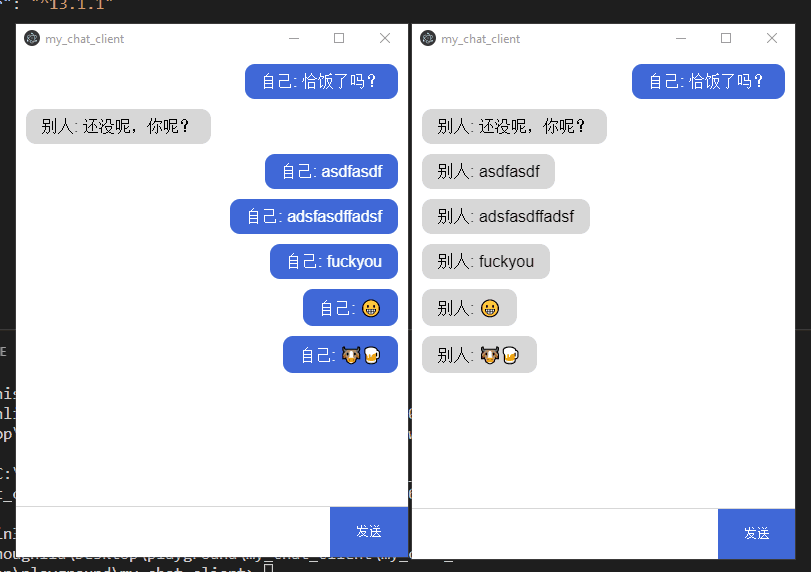

# Simple group chat server and client

I built this program for Electron practice. I walked through many traps during usage of Node.js's C++ addon, and maybe this program is helpful to somebody who want to try electron UI with C++ kernel.



### Portability

Server is built for Linux.

Client is not cross platform(Windows only), due to Node.js's C++ addon usage.

### Components

  ##### my_chat_client
  Client uses electron 5.0.2, and only provides user interface.

  ##### my_chat_client_kernel
  Client kernel provides Windows Socket service to electron, which uses corresponding V8 libary to cooperate with Electron.

  ##### my_chat_server
  Server is a simple message-broadcasting linux socket server(built with epoll).

### Build steps

+ First build and run server on Linux(just use g++), which is pretty simple.

+ Second build client kernel. First open source code and specify server IP, then open powershell in corresponding folder and use node-gyp to build. (CMakeLists.txt is just for unit-test, you can ignore it.) Put the build result(my_chat_client_kernel.node) to the client folder.

```
node-gyp configure --target=5.0.2 --arch=x64 --dist-url=https://electronjs.org/headers 
```

+ Third open poershell and run client.

```
npm start
```